# NyasaBlog Android App

NyasaBlog is a native Android application that interacts with the REST API at [nyasablog.com](https://nyasablog.com/). The platform was created for Malawian content creators to publish Malawian-related content.

## Architecture

The app follows **MVVM with Clean Architecture** principles:

```
UI (Compose) → ViewModel → UseCase → Repository (interface) → RepositoryImpl → Room + Retrofit
```

- **State management**: `StateFlow` for UI state, `SharedFlow` for one-shot events (toasts, navigation)
- **Dependency injection**: Hilt
- **Async**: Kotlin Coroutines and Flow throughout
- **Networking**: Retrofit with `suspend` functions and `safeApiCall` wrapper
- **Persistence**: Room with `Flow`-based queries
- **Pagination**: Paging 3 with `RemoteMediator` for network + cache

## Tech Stack

| Category | Libraries |
|----------|-----------|
| Language | Kotlin 1.9, Java 17 |
| UI | Jetpack Compose, Material 3 |
| DI | Hilt 2.51 |
| Networking | Retrofit 2.11, OkHttp 4.12, Gson |
| Database | Room 2.6 |
| Pagination | Paging 3 |
| Image Loading | Coil 3 (Compose) |
| Auth | Token-based (django-auth-token), EncryptedSharedPreferences |
| Build | KSP, R8, compileSdk 35, minSdk 24 |
| Code Quality | Detekt, Spotless (ktlint), Android Lint |
| Testing | JUnit 4, Turbine, MockK, Truth, Coroutines Test |

## Features

- **Authentication** -- account registration, login, logout with encrypted token storage
- **Blog Feed** -- paginated blog list with search, filtering by date or username, and sort order
- **Blog CRUD** -- create, read, update, and delete blog posts with image uploads
- **Account Management** -- view and update profile, change password
- **Offline Support** -- Room-based caching with single source of truth
- **Connectivity Awareness** -- reactive `ConnectivityObserver` using `NetworkCallback`

## UI Design & Mockups

Design system is Nyasa Horizon, sourced from [Stitch](https://stitch.withgoogle.com/). Click any preview for the full-size render.

| Screen | Preview | Description |
| --- | :---: | --- |
| Welcome | 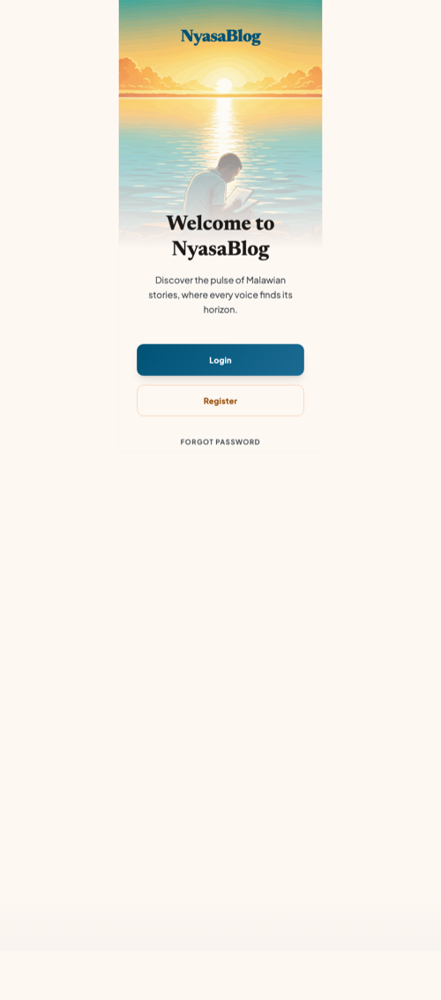 | Landing screen with hero imagery and Login / Register / Forgot Password actions. |
| Login | 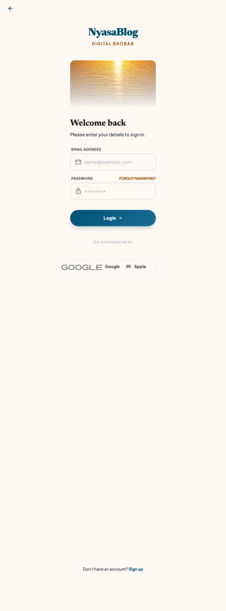 | Email + password sign-in with forgot-password shortcut and social provider slots. |
| Register | 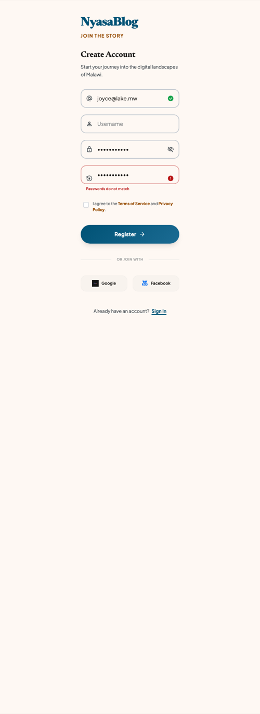 | Account creation form with inline validation and terms acceptance. |
| Forgot Password | 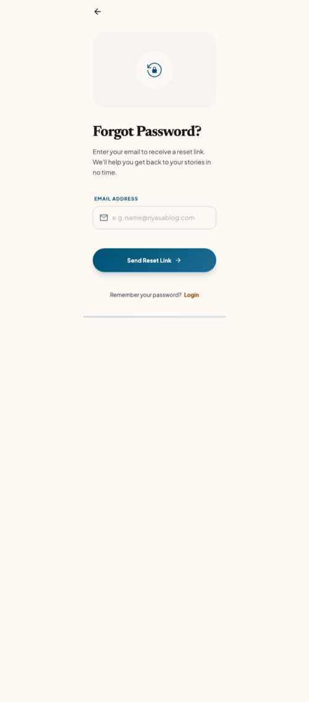 | Email-driven password reset with success and error feedback. |
| Blog Feed - Home | 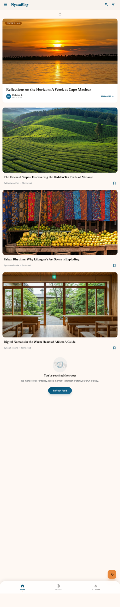 | Paged blog list with top bar, bottom nav, and pull-to-refresh. |
| Blog Feed - Search | 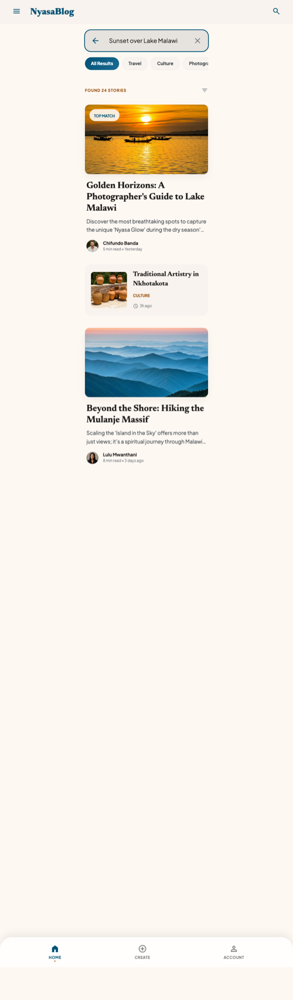 | Query-driven search surface over the same feed. |
| Blog Feed - Filter | 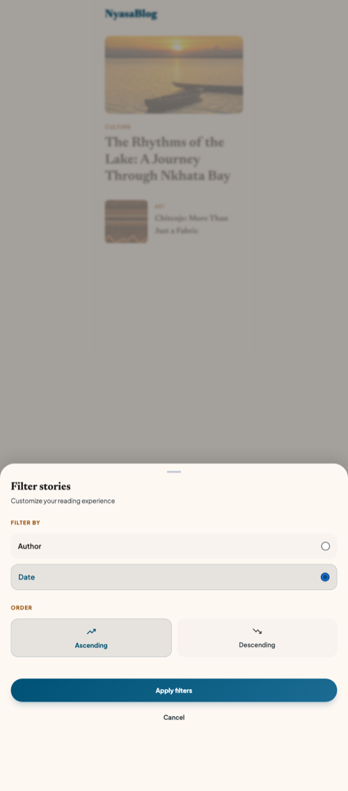 | Category, tag, and sort filter sheet for narrowing the feed. |
| Blog Detail | 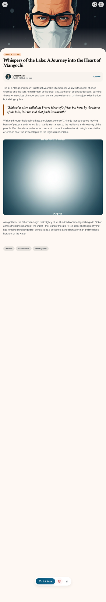 | Native Compose HTML renderer with comments, like, and bookmark actions. |
| Create Blog | 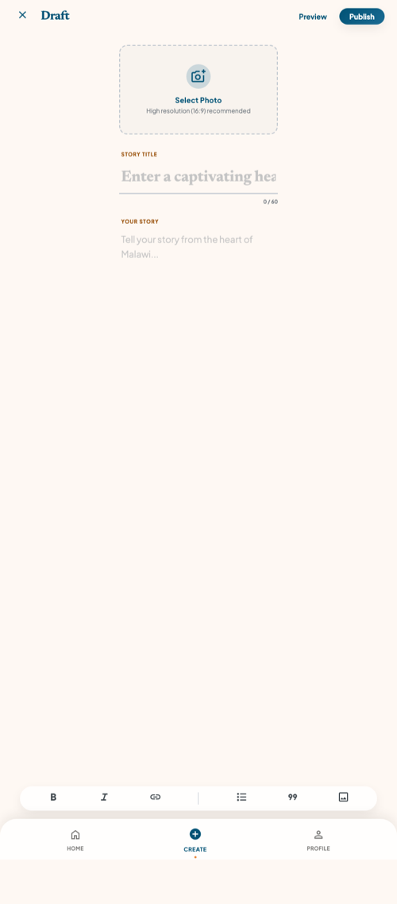 | Blog-post composer with image picker, category dropdown, and tag chips. |
| Edit Blog | 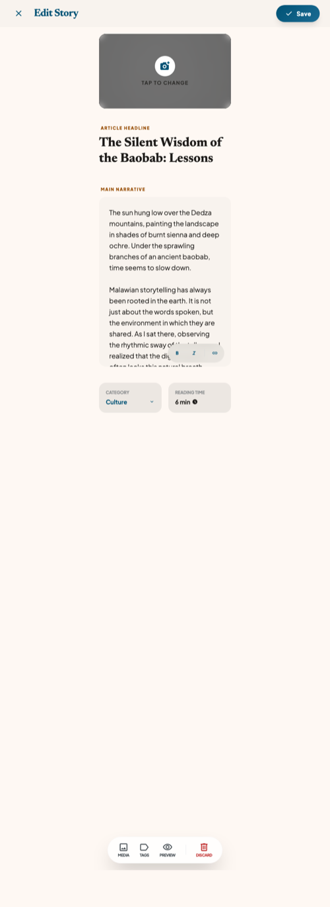 | Existing-post editor that reuses the composer layout. |
| Account Profile | 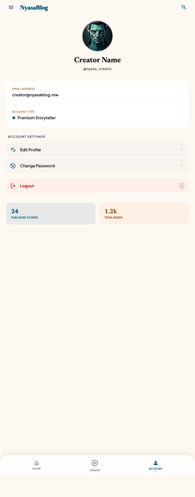 | Signed-in user profile summary with account actions. |
| Edit Account | 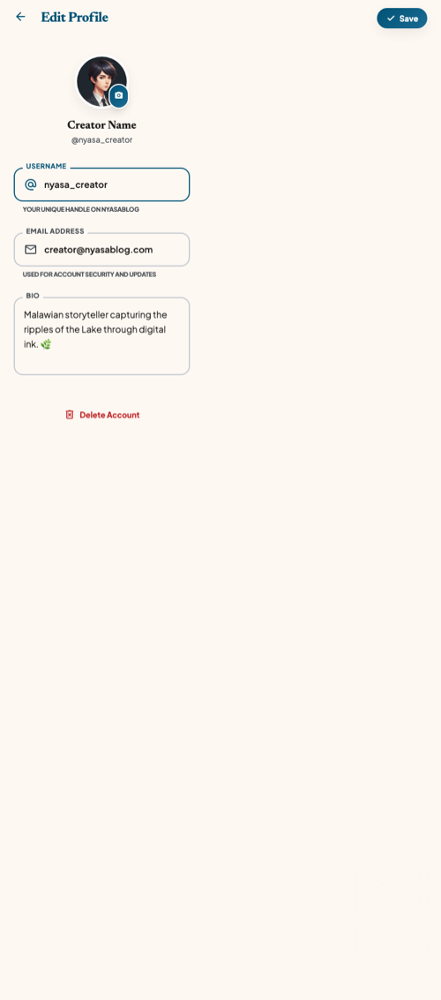 | Inline editing for profile fields (name, email, avatar). |
| Change Password | 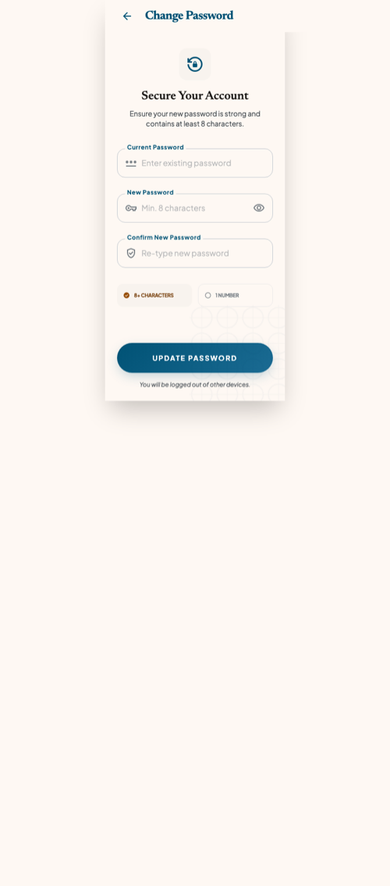 | Password update form with current, new, and confirm inputs. |

## Build

```bash
./gradlew clean assembleDebug
```

## Code Quality

```bash
./gradlew detekt            # Static analysis
./gradlew spotlessCheck     # Formatting check
./gradlew spotlessApply     # Auto-fix formatting
./gradlew lintDebug         # Android lint
```

## Tests

```bash
./gradlew test                  # Unit tests (55 tests)
./gradlew connectedAndroidTest  # Instrumented tests (requires device/emulator)
```

## API

The app communicates with the REST API at `https://nyasablog.com/api/`. Developers are free to interact with the API. Authentication is required for write operations.
